# 项目包结构

controller:接口层，提供restful接口。

exception: 自定义异常工具类。

repository:数据访问层，提供数据库操作。在本示例中未提供数据库持久化功能，所以统一使用内存缓存。

service:业务逻辑层，提供业务逻辑。

vo:视图层对象，封装API接口数据。

/resource/data目录中存放了初始化的100条账户数据，在项目启动时，会自动加载到内存中。可以使用里面的账号进行转账测试。

# 项目Docker部署
1、项目打包：

```
mvn clean package -Dmaven.test.skip=true
```
2、打包镜像

````
docker build -t transactionapp:1.0.0 .
````
3、生成容器
````
docker run -d -p 8080:8080 --name transaction transactionapp:1.0.0
````

## 接口访问方法

### 创建交易接口：本机地址:端口/transaction/create

新增一笔转账参数示例：
````
{
  "accountInfoId": 1,
  "amount": "100.00",
  "currency": "CNY",
  "inCardNo": "HH53DVQYU2DLAGHB",
  "transactionNo": "TXN202506150",
  "transactionType": 1,
  "userId": 1001
}
````

### 更新交易：本机地址:端口/transaction/update

参数示例：

````
{
  "accountInfoId": 1,
  "amount": 1,
  "currency": "CNY",
  "inCardNo": "HH53DVQYU2DLAGHB",
  "transactionNo": "TXN202506150",
  "transactionType": 1,
  "userId": 1001
  
}

````

### 分页查询交易：本机地址:端口/transaction/query/page

参数示例：

````
{
    "pageIndex" : 1,
    "pageSize" : 100,
    "userId" : 1001
}
````

### 删除交易接口：本机地址:端口/transaction/delete/交易号

delete参数示例：
```
 /transaction/delete/TXN20250615001
```

# 压测报告

机器配置情况：

ThinkPad 笔记本
内存：32GB

压测工具：JMeter

CPU核数：14

tomcat线程数：200


## 新建交易接口
接口地址：/transaction/create

| 并发数 | tps    | cpu  | 内存| jemter压测截图              |
|-----|--------|------|-----|-------------------------|
| 10  | 1229.7 | 63%  | 60% | 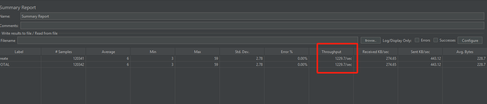 |
| 20  | 2275.2 | 85%  | 60% | 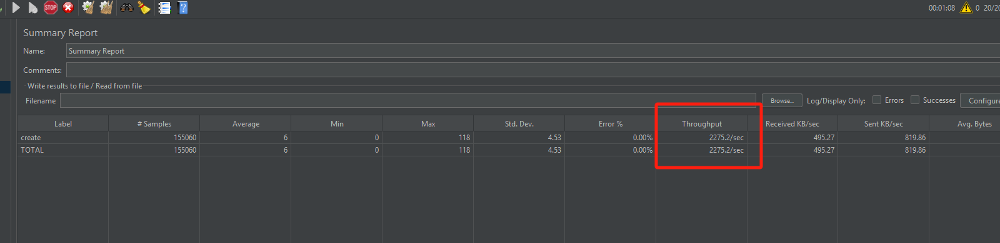 |
| 30  | 1992.5 | 90%  | 60% | 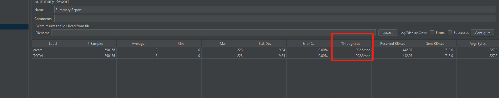 |
| 50  | 1471.9 | 100% | 61% | 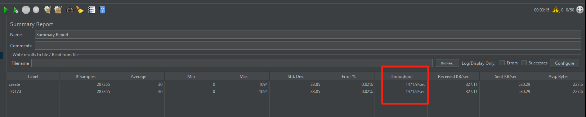 |


## 更新交易接口
接口地址：/transaction/update

| 并发数 | tps     | cpu | 内存| jemter压测截图              |
|-----|---------|-----|-----|-------------------------|
| 10  | 19550.3 | 63% | 60% | 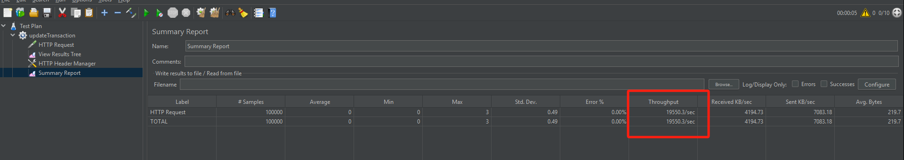|
| 20  | 27228   | 90% | 60% | 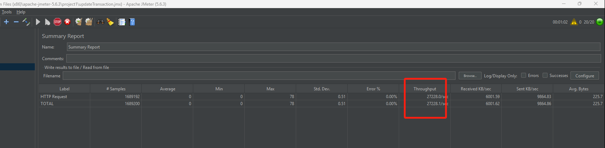 |

## 查询交易接口

接口地址：/transaction/query/page

| 并发数 | qps   | cpu  | 内存  | jemter压测截图              |
|-----|-------|------|-----|-------------------------|
| 10  | 20948 | 92%  | 63% | 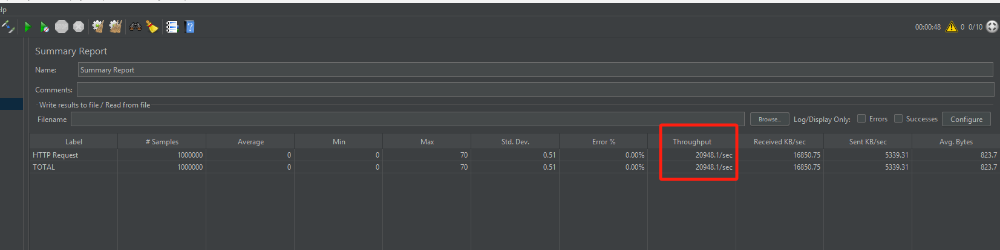 |
| 20  | 28587 | 100% | 63% | 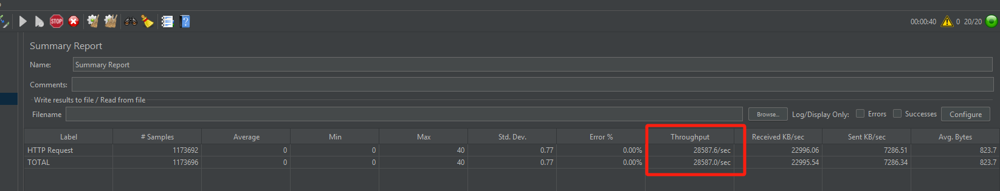|
| 30  | 28405   | 100% | 63% | 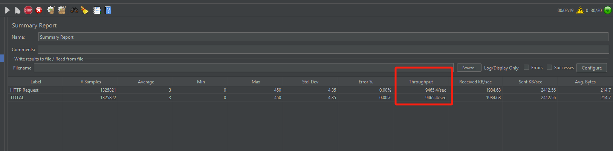|

## 删除交易接口

接口地址：/transaction/delete

| 并发数 | tps   | cpu | 内存  | jemter压测截图              |
|-----|-------|-----|-----|-------------------------|
| 10  | 25667 | 63% | 85% | 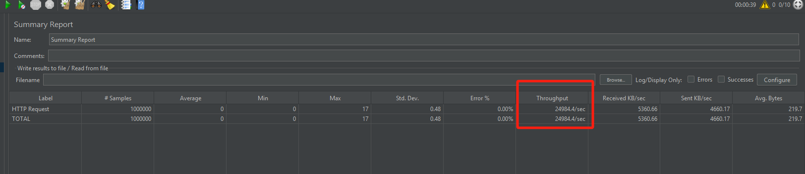|
| 30  | 30000 | 90% | 60% | 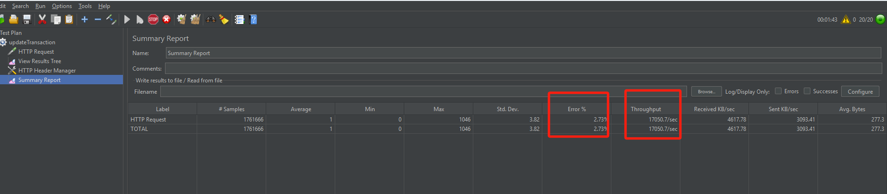 |

并发30压测过程中观察到tps一开始不断网上增加，到达3.5W这个峰值后开始下降，并且开始出现请求超时。

